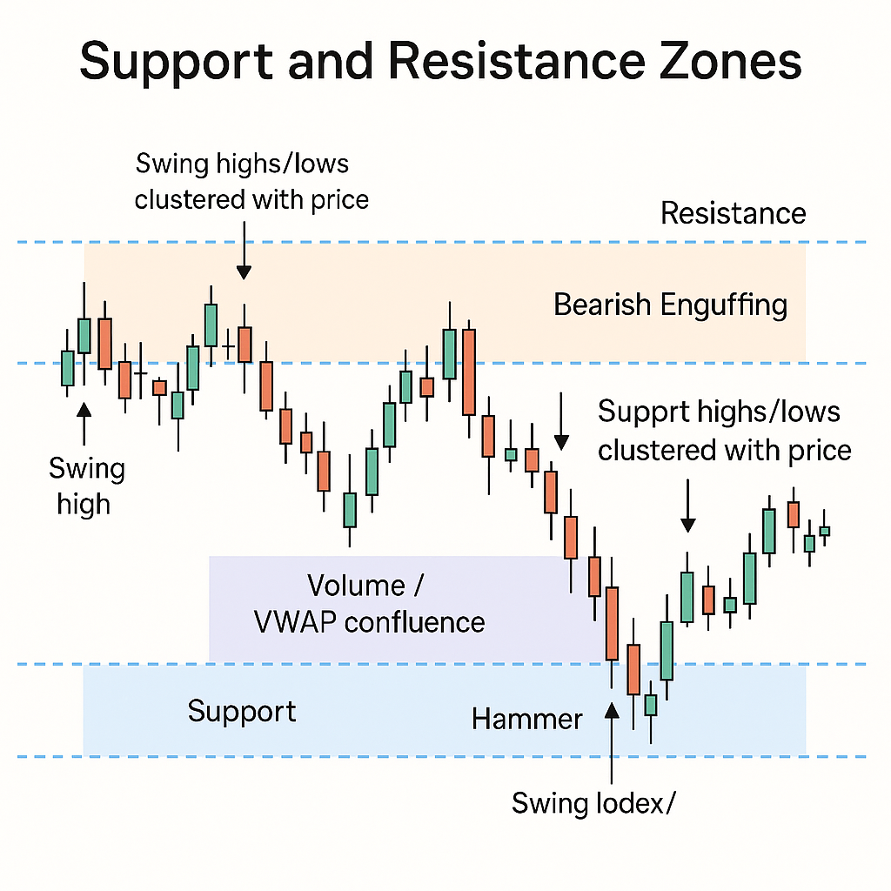

# 📘 Support & Resistance (S/R) System Reference Guide — Intraday Bot

---

## 🔍 What is Support & Resistance?

### 🔹 Support

A **support zone** is a price area where the market tends to **stop falling** and may **bounce back up**.

* Think of it like a **floor** — buyers step in to defend it.

### 🔹 Resistance

A **resistance zone** is where price tends to **stop rising** and may **fall back down**.

* Like a **ceiling** — sellers emerge to push price lower.

➡️ These are not single price points but **price ranges** (called bands).
Example:

```python
band = (23550, 23570)  # 20-point wide resistance zone
```

---


## 🧠 Why Are S/R Zones Important?

| Role in Trading   | How Our Bot Uses It                                                  |
| ----------------- | -------------------------------------------------------------------- |
| Avoid bad entries | Bot avoids buying into resistance or selling into support            |
| Spot reversals    | Bot reacts to patterns forming at S/R zones                          |
| Confirm breakouts | If price breaks S/R and retests, bot can trade with confidence       |
| Add confluence    | If multiple S/R sources agree (e.g., swing + VWAP), zone is stronger |

---

## 📚 Key Concepts & Terminology

### 📈 ATR — Average True Range

* Measures **market volatility**.
* Helps us know how far price typically moves in one candle.

#### Example:

```python
ATR = df['high'] - df['low']
df['atr'] = ATR.rolling(window=14).mean()
```

Use Cases:

* Swing detection: Confirm a reversal if price drops more than ATR
* Zone filtering: Allow wider zones during volatile periods

---

### 📊 VWAP — Volume Weighted Average Price

* Tells us the **average price traders paid**, weighted by volume.
* Often used by institutions as a fair value benchmark.

#### Example:

```python
vwap = (df['close'] * df['volume']).cumsum() / df['volume'].cumsum()
df['vwap'] = vwap
```

Use Cases:

* Anchored VWAP from open or breakout → defines fair value
* Bot creates a zone around this anchor (±0.5%) to mark interest

---

### 🔘 Volume Profile

* Shows **how much volume traded** at different price levels
* Helps spot zones where market accepted price strongly

#### Example Output:

```python
[(23500, 23520), (23430, 23450), (23610, 23625)]  # zones with highest volume
```

Use Cases:

* Adds confidence to swing zones
* Helps define resistance or support zones

---

## ⚙️ Core Modules with Use & Output Examples

### 1. `swing_detector.py`

**Purpose**: Detect price reversals using ATR-based thresholds

#### Code Example:

```python
swing_hi, swing_lo = detect_reversal_swings(df)
```

#### Output:

```python
swing_hi.head()
# timestamp        high
# 2025-07-01 10:30 23595.80
```

---

### 2. `zone_cluster.py`

**Purpose**: Group swing highs/lows into zones using DBSCAN

#### Code Example:

```python
zones = cluster_zones(swing_lo['low'], atr_series=df['atr'])
```

#### Output:

```python
{'band': (23420, 23435), 'touch_count': 3, 'confidence': 'high'}
```

---

### 3. `anchor_vwap.py`

**Purpose**: Create VWAP-based zones from meaningful anchor points

#### Code Example:

```python
zones = get_vwap_zones(df, anchor_point='open')
```

#### Output:

```python
[(23560.0, 23610.0)]
```

---

### 4. `volume_profile.py`

**Purpose**: Detect volume-heavy price areas using histogram

#### Code Example:

```python
zones = get_volume_profile_zones(fut_df)
```

#### Output:

```python
[{'band': (23500, 23520), 'volume_cluster': True, ...}]
```

---

### 5. `zone_fallback.py`

**Purpose**: Add prev-day high/low/close if no good zones exist

#### Code Example:

```python
fallback_zones = get_prev_day_ohlc_zones(df)
```

#### Output:

```python
[{'band': (23580, 23590), 'type': 'resistance'}]
```

---

### 6. `zone_filter.py`

**Purpose**: Remove overlapping or weak zones using ATR spacing logic

#### Code Example:

```python
filtered = filter_and_validate_zones(zones, atr=25.0)
```

#### Output:

```python
List of clean, spaced-out zones with confidence
```

---

### 7. `zone_scorer.py`

**Purpose**: Assign score to each zone based on its strength and confluence

#### Code Example:

```python
scored = score_zones(filtered)
```

#### Output:

```python
[{'band': (23450, 23465), 'score': 8.2}]
```

---

### 8. `zone_builder.py`

**Purpose**: Main pipeline to create full S/R map for a timeframe

#### Code Example:

```python
zones = get_active_zones(df_5m, fut_df=fut_5m, tf_label="5m")
```

#### Output:

```python
List of all zones (swing, vwap, volume, fallback)
```

---

### 9. `multi_tf_merger.py`

**Purpose**: Merge zones across 5m, 15m, 1h timeframes

#### Code Example:

```python
merged_zones = merge_timeframe_zones(zones_by_tf)
```

#### Output:

```python
Zone with multiple TF tags and boosted score
```

---

### 10. `zone_multiframe.py`

**Purpose**: Entry point for generating multi-TF S/R zones

#### Code Example:

```python
zones = build_zones_multi_tf({"5m": df_5m, "15m": df_15m}, fut_df_dict)
```

---

## ✅ Final Example Output (Single Zone):

```python
{
  "type": "resistance",
  "band": (23650, 23670),
  "score": 8.7,
  "touch_count": 4,
  "confidence": "high",
  "timeframes": ["5m", "15m"],
  "sources": ["swing", "vwap"],
  "volume_cluster": True,
  "vwap_zone": True,
  "last_touched": "2025-07-05 10:20"
}
```


## 🔄 New Enhancements Added

### 🧱 Flip Zone Detection
- Zones are now tagged with `"flipped": True` if price broke and retested them
- Adds `"subtype": "retest"` for these retests
- Useful for detecting breakout–retest setups

### 🏷 Zone Source Tagging
- Each zone now includes `sources`: e.g. `["swing", "volume"]`, `["vwap"]`
- Helps understand what contributed to the zone's creation

### 🎯 Confidence & Score Normalization
- `score`: raw numerical value (scaled from zone features)
- `normalized_score`: 0–10 scale (capped)
- `confidence`: `"high"`, `"medium"`, or `"low"` based on score

### 🧠 Zone Subtypes
- `primary`: default zones (from swings, volume, vwap)
- `retest`: flipped/retested zones
- `fallback`: prev-day OHLC zones

### ✅ Final Example Output (Enhanced):

```python
{
  "type": "support",
  "band": (23560, 23575),
  "score": 8.5,
  "normalized_score": 8.5,
  "confidence": "high",
  "touch_count": 5,
  "timeframes": ["5m", "15m"],
  "sources": ["swing", "volume"],
  "flipped": True,
  "subtype": "retest",
  "volume_cluster": True,
  "vwap_zone": False,
  "last_touched": "2025-07-05 10:20"
}
```

---
