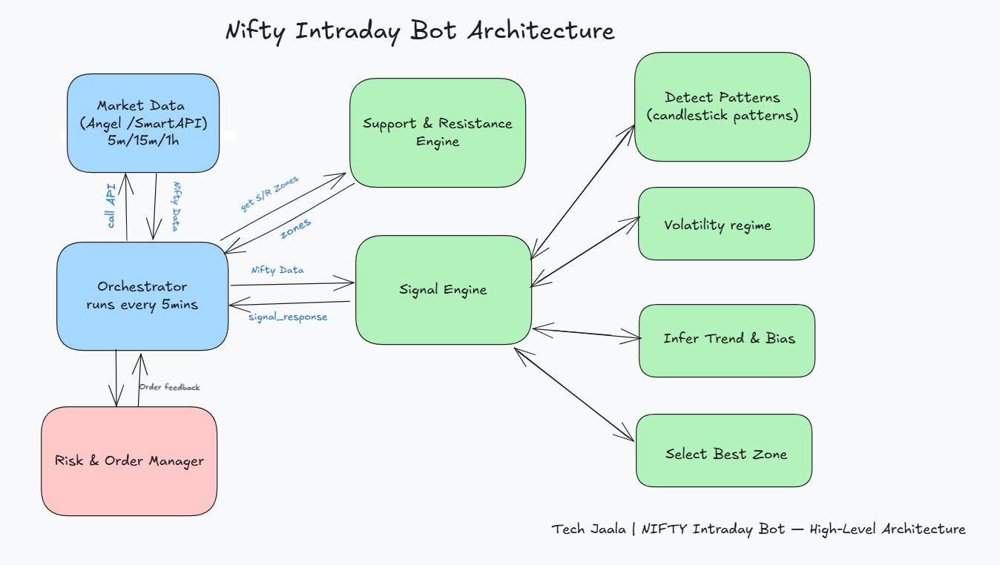

# 📈 Nifty Intraday Options Bot (SmartAPI)

This is a **data-driven intraday NIFTY options trading bot** built using **Angel One’s SmartAPI**.  
It runs every 5 minutes, detects breakout and reversal patterns, and generates simulated CE/PE trade signals using **multi-timeframe analysis**, **support/resistance zones**, and **volatility-based scoring**.

> ⚠️ **Note:**  
> This demo version is configured for **dry-run mode only**.  
> All order placement and exit API calls are **disabled for safety** — no live trades are executed.  
> The full architecture supports SmartAPI integration for live execution if enabled.

---

## ✅ Architecture


---
## ⚙️ Installation

```bash
git clone https://github.com/yourusername/nifty-intraday-bot-demo.git
cd nifty-intraday-bot-demo
pip install -r requirements.txt


python main.py

``

## ⚙️ Configuration

Edit values in `config/settings.py`:

```python
CAPITAL = 50000
RISK_PER_TRADE = 0.02
SL_ATR_MULTIPLIER = 1.2
TARGET_ATR_MULTIPLIER = 2.0
TRAIL_SL_ENABLED = True
ENABLE_PRETARGET_TRAIL_SL = True

# For SmartAPI:
SMART_API_KEY = os.getenv("SMART_API_KEY")
SMART_API_CLIENT_ID = os.getenv("SMART_API_CLIENT_ID")
SMART_API_PIN = os.getenv("SMART_API_PIN")
SMART_API_TOTP_SECRET = os.getenv("SMART_API_TOTP_SECRET")

# For Telegram alerts:
TELEGRAM_TOKEN = os.getenv("TELEGRAM_TOKEN")
TELEGRAM_CHAT_ID = os.getenv("TELEGRAM_CHAT_ID")

🚀 How to Run

🔧 Setup .env file with API credentials (optional):

SMART_API_KEY=xxx
SMART_API_CLIENT_ID=xxx
SMART_API_PIN=xxx
SMART_API_TOTP_SECRET=xxx
TELEGRAM_TOKEN=xxx
TELEGRAM_CHAT_ID=xxx


📦 Install dependencies:

pip install -r requirements.txt

    
▶️ Run the bot:

python main.py

## Dry-Run Mode

By default, the bot runs in **dry-run mode** — it simulates entries and exits using logged signals.  
If you wish to enable live order placement, uncomment the API execution lines in:
- `core/order_manager.py`
- `core/risk_manager.py`

Ensure your Angel SmartAPI credentials are valid and handle responsibly.


✅ Best Practices
- Run using virtual environment

- Schedule via CRON or PM2

- Backtest your strategies before real trading

- Enable TRAIL_SL_ENABLED + ENABLE_PRETARGET_TRAIL_SL for dynamic exits

🛑 Disclaimer
This project is for educational purposes only. Use it at your own risk.
Trading options involves risk. Please consult with a certified advisor before deploying real capital.

👨‍💻 Author
Abhishek G | Techjaala
GitHub: github.com/abhishek-techjaala

Happy Trading! 🚀📊💰